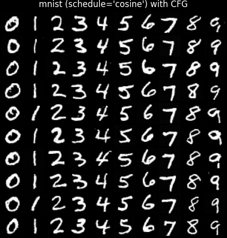
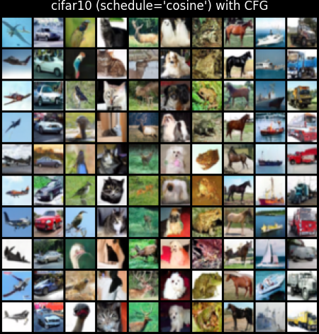

## ✨ Project Highlights

- Built and trained a **Denoising Diffusion Probabilistic Model (DDPM)** from scratch with a cosine noise schedule for improved training stability.

- Implemented **classifier-free guidance** for controllable conditional generation.

- Derived the diffusion training objective from the maximum likelihood formulation via a variational lower bound (ELBO), resulting in the noise-prediction loss used in DDPM training; documented the complete derivation in a technical write-up.

  
  

